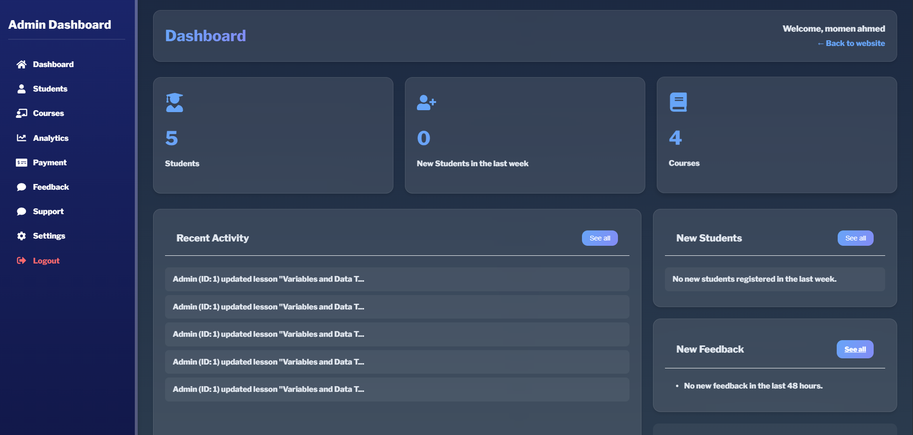
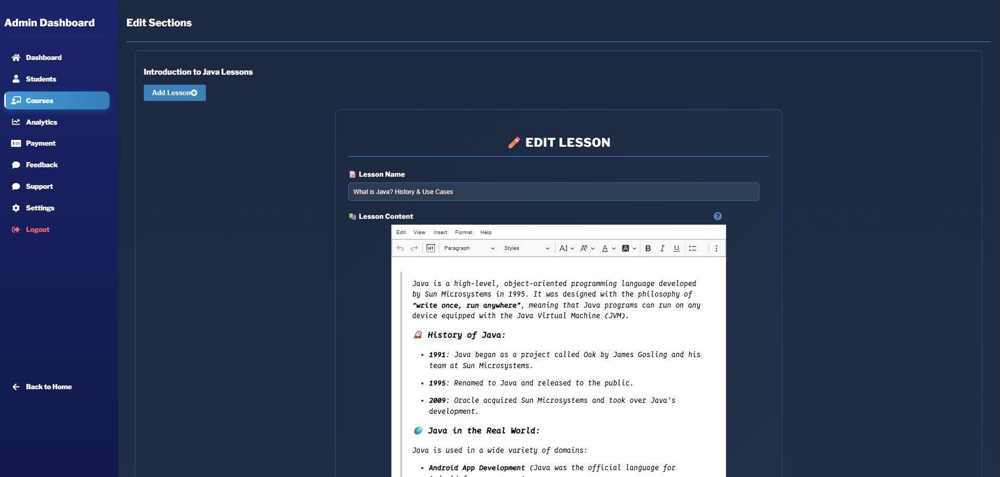

# 🚀 DevQuest Showcase

> This repository highlights **DevQuest**, an innovative interactive coding education platform that integrates gamification to enhance hands-on learning.

🔒 **Important**: This repository is for **portfolio and review purposes only**. The full source code is private and not shared here. Please refrain from copying, reusing, or distributing any code presented in this showcase.
[Visit DevQuest](https://www.dev-quest.tech/)

---

## 🧠 Learning Experience

- Real-time interactive code editor
- Support for multiple programming languages (Python, JavaScript, Java, C++, and more)
- Automated test case validation system
- Achievement-based progress tracking
- Customizable learning paths for personalized education
- Instant feedback on coding exercises

---

## 📚 Course System

- Structured and guided learning paths
- Interactive lessons with embedded practice exercises
- Predefined code templates and helpful hints
- Automated solution validation with test cases
- Section-wise organization for seamless navigation

---

## 👤 User Features

- Personalized dashboards for tracking progress
- Skill and achievement tracking
- Profile customization options
- Gamified features like achievements and learning streaks

---

## 👑 Admin Dashboard

- Comprehensive course and content management tools
- User management capabilities
- Analytics and logging for tracking platform performance
- System maintenance tools for administrators

---

## 🛠️ Technology Stack

### **Frontend:**
- React 18 with Vite
- React Router DOM v6, Context API, Axios
- UI Frameworks: Material-UI, Styled Components, React Icons, Monaco Editor
- Notifications: React Hot Toast
- Styling: CSS Modules

### **Backend:**
- Node.js with Express.js
- PostgreSQL for database management
- JWT for authentication
- AWS S3 for file storage
- Stripe for payment processing

### **Security:**
- Implementations include Helmet, Rate Limiting, XSS Protection, and CORS

---

## 🔍 Preview

---

## 🚧 Disclaimer

This repository serves as a **read-only showcase**. The actual application codebase is private to protect proprietary information and maintain security.
